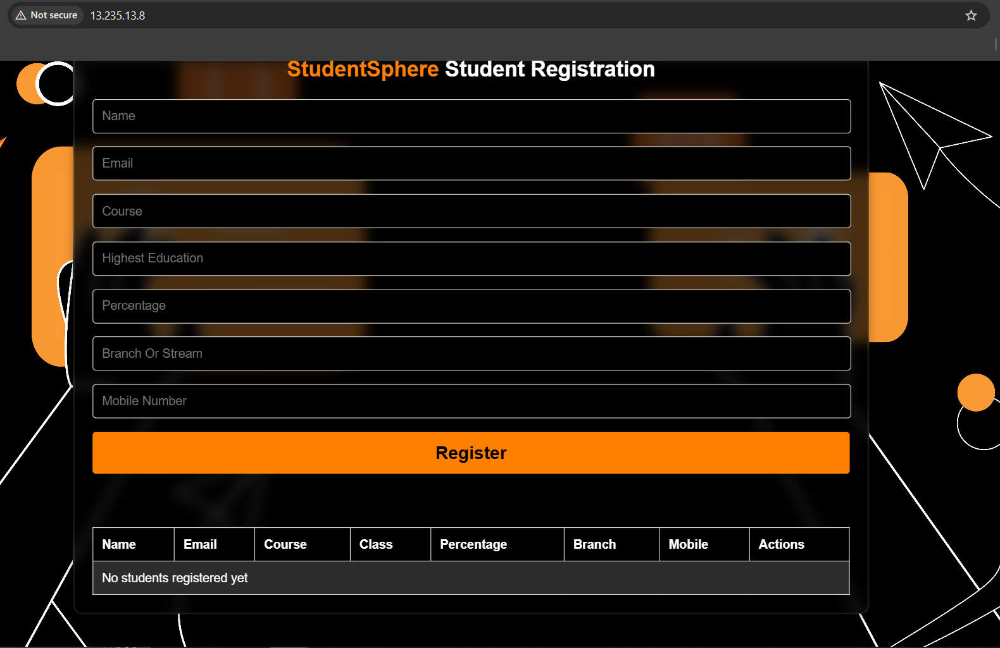
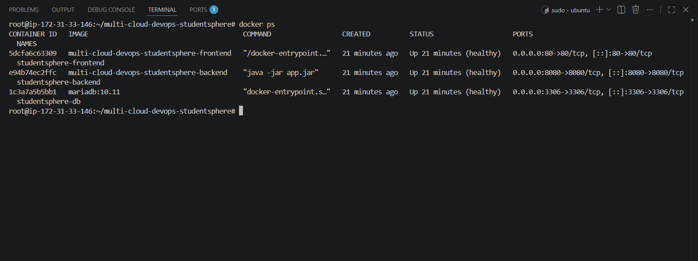
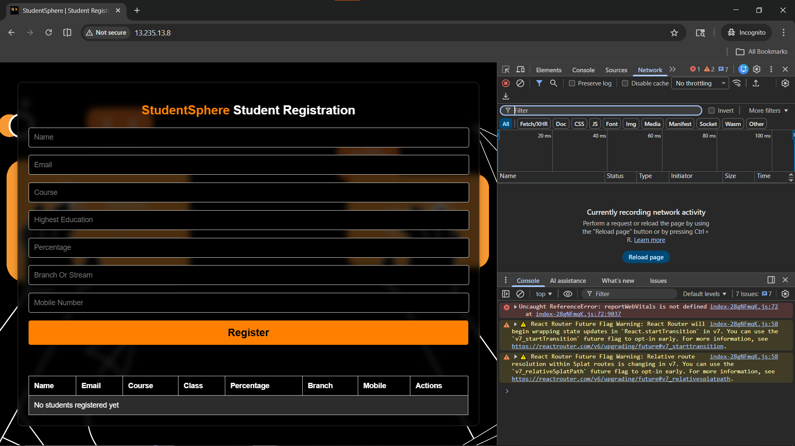
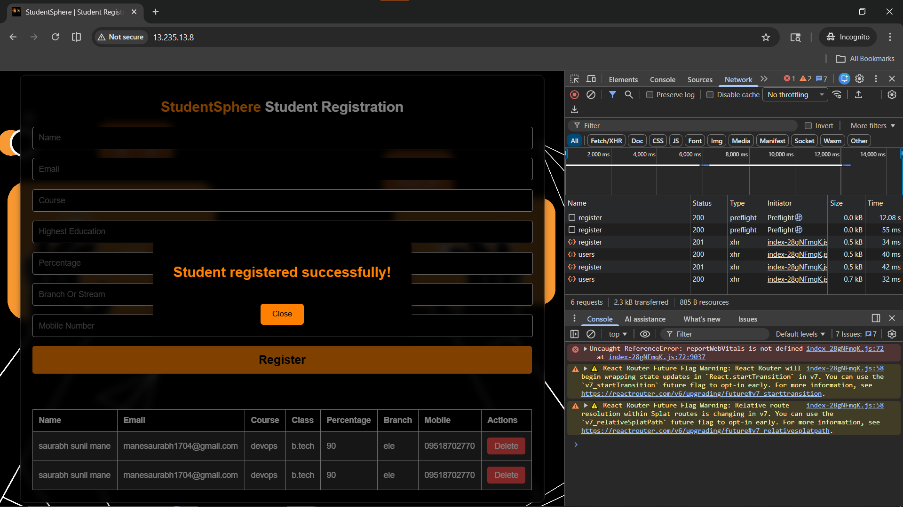
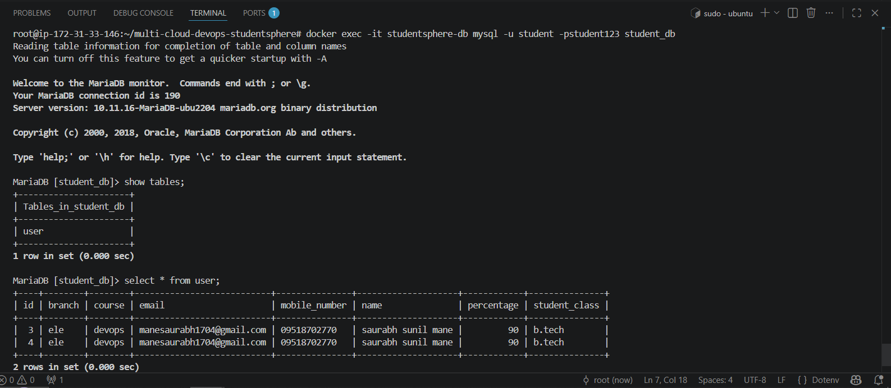

# 🚀 Multi-Cloud DevOps StudentSphere

> Production-grade multi-cloud DevOps project — React + Spring Boot + MariaDB deployed across AWS, Azure, and GCP.
> Built to demonstrate real-world DevOps skills — CI/CD, GitOps, Security, Monitoring, and Multi-Cloud deployment.



---

## 🏗️ Application Architecture

```
Browser → Frontend (Nginx:80) → Backend (Spring Boot:8080) → MariaDB (3306)
```

---

## 📚 Tech Stack

| Layer | Technology |
|---|---|
| Frontend | React 18 + Vite + Nginx |
| Backend | Spring Boot 3.3.5 + Java 17 |
| Database | MariaDB 10.11 |
| Container | Docker + Docker Compose |
| Cloud | AWS EKS (Phase 2) |
| CI/CD | Jenkins (Phase 3) |
| IaC | Terraform (Phase 4) |
| Advanced K8s | HPA + Canary + Blue-Green + Helm (Phase 5) |
| GitOps | ArgoCD (Phase 6) |
| Security | RBAC + Trivy + Network Policies (Phase 7) |
| Monitoring | Prometheus + Grafana + Alertmanager (Phase 8) |
| Logging | Fluent Bit + Elasticsearch + Kibana (Phase 8) |
| Multi-Cloud | Azure AKS + GCP GKE (Phase 9) |

---

## 🗂️ Repository Structure

```
multi-cloud-devops-studentsphere/
├── backend/                    # Spring Boot REST API
│   ├── src/                    # Java source code
│   │   ├── controller/         # REST API endpoints
│   │   ├── model/              # Entity classes
│   │   ├── repository/         # Database layer
│   │   └── config/             # CORS configuration
│   ├── dockerfile              # Multi-stage Docker build
│   └── pom.xml                 # Maven dependencies
├── frontend/                   # React + Vite + Nginx
│   ├── src/                    # React source code
│   │   ├── components/         # UI components
│   │   ├── api/                # API service layer
│   │   └── hooks/              # Custom React hooks
│   ├── dockerfile              # Multi-stage Docker build
│   └── nginx.conf              # Nginx reverse proxy config
├── k8s/                        # Kubernetes manifests
│   ├── aws/                    # AWS EKS specific
│   ├── azure/                  # Azure AKS specific
│   └── gcp/                    # GCP GKE specific
├── terraform/                  # Infrastructure as Code
│   ├── aws/                    # AWS infrastructure
│   ├── azure/                  # Azure infrastructure
│   └── gcp/                    # GCP infrastructure
├── jenkins/                    # CI/CD pipelines
├── monitoring/                 # Prometheus + Grafana
│   ├── prometheus/
│   ├── grafana/
│   └── alertmanager/
├── logging/                    # EFK Stack
│   ├── fluentbit/
│   └── elasticsearch/
├── helm/                       # Helm charts
│   └── studentsphere/
├── screenshots/                # Phase-wise proof
├── docs/                       # Phase documentation
├── .env.example                # Environment variables template
└── compose.yml                 # Local Docker Compose setup
```

---

## 🚀 Project Phases

| Phase | Topic | Status |
|---|---|---|
| ✅ Phase 1 | Local Docker Setup | Complete |
| 🔄 Phase 2 | AWS EKS Deployment | In Progress |
| ⏳ Phase 3 | CI/CD Jenkins | Pending |
| ⏳ Phase 4 | Terraform IaC | Pending |
| ⏳ Phase 5 | Advanced K8s (HPA + Canary + Blue-Green) | Pending |
| ⏳ Phase 6 | GitOps ArgoCD | Pending |
| ⏳ Phase 7 | Security (RBAC + Trivy + Network Policies) | Pending |
| ⏳ Phase 8 | Observability (Prometheus + Grafana + EFK) | Pending |
| ⏳ Phase 9 | Multi-Cloud (Azure AKS + GCP GKE) | Pending |

---

## ⚡ Phase 1 — Local Docker Setup

### What
Full-stack application (React + Spring Boot + MariaDB) running locally using Docker Compose.
Single command brings up all three services with proper networking, health checks, and persistent storage.

### Why
- Validate complete application works end-to-end before cloud deployment
- Multi-stage Dockerfiles reduce image size significantly
- Nginx reverse proxy handles frontend routing and API proxying
- Environment variables used everywhere — no hardcoded credentials
- Health checks ensure services start in correct order

### How

#### Prerequisites
```
- Docker + Docker Compose installed
- Git installed
- Ports 80 and 8080 available
```

#### Step 1 — Clone Repository
```bash
git clone https://github.com/manesaurabh1704-devops/multi-cloud-devops-studentsphere.git
cd multi-cloud-devops-studentsphere
```

#### Step 2 — Setup Environment
```bash
cp .env.example .env
cat .env
```

Expected output:
```
DB_NAME=student_db
DB_USER=student
DB_PASS=student123
VITE_API_URL=/api
```

#### Step 3 — Start All Services
```bash
docker compose up --build
```

#### Step 4 — Verify All Containers Running
```bash
docker ps
```

Expected output:
```
CONTAINER ID   IMAGE                    STATUS
xxxxxxxxxxxx   studentsphere-frontend   Up (healthy)
xxxxxxxxxxxx   studentsphere-backend    Up (healthy)
xxxxxxxxxxxx   studentsphere-db         Up (healthy)
```

#### Step 5 — Test Backend Health
```bash
curl http://localhost:8080/api/health
```

Expected output:
```
Backend is healthy!
```

#### Step 6 — Test Student Registration API
```bash
curl -X POST http://localhost:8080/api/register \
  -H "Content-Type: application/json" \
  -d '{
    "name": "Saurabh Mane",
    "email": "saurabh@test.com",
    "course": "DevOps",
    "studentClass": "B.Tech",
    "percentage": 90,
    "branch": "IT",
    "mobileNumber": "9876543210"
  }'
```

Expected output:
```json
{
  "id": 1,
  "name": "Saurabh Mane",
  "email": "saurabh@test.com",
  "course": "DevOps",
  "studentClass": "B.Tech",
  "percentage": 90.0,
  "branch": "IT",
  "mobileNumber": "9876543210"
}
```

#### Step 7 — Fetch All Students
```bash
curl http://localhost:8080/api/users
```

#### Step 8 — Access Frontend
```
http://localhost:80
```

### Output / Proof

#### Docker Containers Running


#### API Health Check


#### Frontend Application


#### Student Registered Successfully


#### Student Table with Data


### Docker Image Size Comparison

| Service | Before (Single-stage) | After (Multi-stage) | Improvement |
|---|---|---|---|
| Backend | 700 MB | 200 MB | 3.5x smaller |
| Frontend | 400 MB | 25 MB | 16x smaller |

---

## 🐛 Phase 1 — Troubleshooting

### Problem 1 — `openjdk:17-jre-slim` Not Found

#### Error
```
failed to solve: openjdk:17-jre-slim: not found
```

#### Root Cause
`openjdk` official Docker images have been deprecated on Docker Hub.

#### Solution
```dockerfile
# BEFORE — WRONG
FROM openjdk:17-jre-slim

# AFTER — CORRECT
FROM eclipse-temurin:17-jre-jammy
```

---


### Problem 2 — Student Data Not Saving on EC2

#### Root Cause
`VITE_API_URL` was pointing to `localhost` which does not work on EC2,
and hardcoded EC2 IP breaks when instance restarts:
```bash
# WRONG — does not work on EC2
VITE_API_URL=http://localhost:8080/api

# WRONG — breaks on instance restart
VITE_API_URL=http://13.235.13.8:8080/api
```

#### Solution
Used Nginx reverse proxy instead of direct backend URL:
```bash
# CORRECT — Nginx proxies /api/ to backend container
VITE_API_URL=/api
```

`nginx.conf` already had this configured:
```nginx
location /api/ {
    proxy_pass http://backend:8080/api/;
    proxy_set_header Host $host;
    proxy_set_header X-Real-IP $remote_addr;
}
```

---


### Problem 3 — `version` is Obsolete Warning

#### Warning
```
compose.yml: `version` is obsolete
```

#### Root Cause
Docker Compose v2 has deprecated the `version` field.

#### Solution
This is just a warning, not an error — application works normally.
The `version: "3.8"` line will be removed in a future cleanup.

---

## 📋 API Endpoints

| Method | Endpoint | Description |
|---|---|---|
| GET | `/api/health` | Backend health check |
| GET | `/api/users` | Get all students |
| GET | `/api/users/{id}` | Get student by ID |
| POST | `/api/register` | Register new student |
| PUT | `/api/users/{id}` | Update student by ID |
| DELETE | `/api/users/{id}` | Delete student by ID |

---

## ⚡ Phase 2 — AWS EKS Deployment

### What
Full-stack app deployed on AWS EKS Managed Kubernetes with persistent
storage, load balancing, and self-healing pods.

### Why
- Docker Compose = single server = not production grade
- EKS = managed Kubernetes = auto-scaling + self-healing
- LoadBalancer = public URL = accessible from anywhere
- EBS volume = data persists even if pod restarts
- 2 replicas = no single point of failure

### Architecture
Internet → AWS LoadBalancer → Frontend Pods (x2) → Backend Pods (x2) → MariaDB StatefulSet → EBS Volume (5Gi)

### How / 🐛 Phase 2 — Troubleshooting /📸 Output / Proof

| [kubernetes-production-setup](https://github.com/manesaurabh1704-devops/kubernetes-production-setup) | Pure Kubernetes — Deployment, Service, Ingress, HPA, RBAC |

---

## 🔗 Related Repositories

| Repository | Purpose |
|---|---|
| [kubernetes-production-setup](https://github.com/manesaurabh1704-devops/kubernetes-production-setup) | Pure Kubernetes — Deployment, Service, Ingress, HPA, RBAC |
| [terraform-multi-cloud-infra](https://github.com/manesaurabh1704-devops/terraform-multi-cloud-infra) | AWS + Azure + GCP Infrastructure as Code |
| [ci-cd-devops-pipelines](https://github.com/manesaurabh1704-devops/ci-cd-devops-pipelines) | Jenkins pipelines + GitHub Actions + Trivy |
| [monitoring-observability-stack](https://github.com/manesaurabh1704-devops/monitoring-observability-stack) | Prometheus + Grafana + Alertmanager |
| [devops-security-secrets](https://github.com/manesaurabh1704-devops/devops-security-secrets) | RBAC + Network Policies + Secrets + Trivy |

---

## 👨‍💻 Author

**Saurabh Mane** — DevOps Engineer
- GitHub: [@manesaurabh1704-devops](https://github.com/manesaurabh1704-devops)

---

> ⭐ Star this repository if you find it helpful!
