# 🚀 Multi-Cloud DevOps StudentSphere

> A production-grade, multi-cloud DevOps project built to demonstrate real-world engineering skills —
> from local Docker setup to AWS EKS, Jenkins CI/CD, GitOps, Zero-Trust Security, and Observability.
> The same app runs on AWS, Azure, and GCP — proving cloud-agnostic deployment skills.


---

## 🏗️ Application Overview

**StudentSphere** is a full-stack student registration system.

## 🏗️ Application Architecture

```
Browser → React (Nginx:80) → Spring Boot (8080) → MariaDB (3306)
```

## 📚 Tech Stack

| Layer | Technology | Why |
|---|---|---|
| Frontend | React 18 + Vite + Nginx | Modern SPA with reverse proxy |
| Backend | Spring Boot 3.3.5 + Java 17 | Production-grade REST API |
| Database | MariaDB 10.11 | Relational DB with persistent storage |
| Container | Docker + Docker Compose | Portable, reproducible builds |
| Orchestration | Kubernetes (EKS/AKS/GKE) | Auto-scaling, self-healing |
| CI/CD | Jenkins | Automated build → test → deploy |
| IaC | Terraform | Reproducible cloud infrastructure |
| GitOps | ArgoCD | Git as single source of truth |
| Security | RBAC + Trivy + Network Policies | Zero-trust approach |
| Monitoring | Prometheus + Grafana + Alertmanager | Full observability |
| Multi-Cloud | AWS + Azure + GCP | Cloud-agnostic deployment |

---

## ☁️ Why Multi-Cloud?

```
Single Cloud Risk:     If AWS goes down → App goes down
Multi-Cloud Benefit:   AWS down → Switch to Azure or GCP instantly

Real-world companies (Netflix, Uber, Airbnb) use multi-cloud for:
→ Vendor lock-in avoidance
→ Cost optimization (use cheapest cloud per region)
→ Compliance (some data must stay in specific regions)
→ Disaster recovery
```

This project deploys the **same application** on:
```
✅ AWS  — EKS (Primary)
✅ Azure — AKS (Secondary)
✅ GCP  — GKE (Tertiary)
```

The same Kubernetes manifests work on all three — only the cluster endpoint changes.

---

## 🗂️ Repository Structure

```
multi-cloud-devops-studentsphere/
├── backend/                    # Spring Boot REST API
│   ├── src/                    # Java source code
│   │   ├── controller/         # REST endpoints
│   │   ├── model/              # Entity classes
│   │   ├── repository/         # Database layer
│   │   └── config/             # CORS configuration
│   ├── dockerfile              # Multi-stage Docker build
│   └── pom.xml                 # Maven dependencies
├── frontend/                   # React + Vite + Nginx
│   ├── src/
│   │   ├── components/         # UI components
│   │   ├── api/                # API service layer
│   │   └── hooks/              # Custom React hooks
│   ├── dockerfile              # Multi-stage Docker build
│   └── nginx.conf              # Reverse proxy config
├── k8s/                        # Kubernetes manifests
│   ├── aws/                    # AWS EKS manifests
│   ├── azure/                  # Azure AKS manifests
│   └── gcp/                    # GCP GKE manifests
├── terraform/                  # Infrastructure as Code
│   ├── aws/                    # AWS VPC + EKS + ECR
│   ├── azure/                  # Azure AKS (Phase 9)
│   └── gcp/                    # GCP GKE (Phase 9)
├── docs/                       # Phase-wise documentation
│   ├── PHASE5-ADVANCED-K8S.md
│   ├── PHASE6-ARGOCD.md
│   ├── PHASE7-SECURITY.md
│   └── PHASE8-OBSERVABILITY.md
├── screenshots/                # Phase-wise proof
├── .env.example                # Environment variables template
└── compose.yml                 # Local Docker Compose
```

---

## 🚀 Project Phases

| Phase | Topic | Status |
|---|---|---|
| ✅ Phase 1 | Local Docker Setup | Complete |
| ✅ Phase 2 | AWS EKS Deployment | Complete |
| ✅ Phase 3 | CI/CD Jenkins | Complete |
| ✅ Phase 4 | Terraform IaC | Complete |
| ✅ Phase 5 | Advanced K8s (HPA + Canary + Blue-Green) | Complete |
| ✅ Phase 6 | GitOps ArgoCD | Complete |
| ✅ Phase 7 | Security (RBAC + Trivy + Network Policies) | Complete |
| ✅ Phase 8 | Observability (Prometheus + Grafana + Alertmanager) | Complete |
| ✅ Phase 9 | Multi-Cloud (Azure AKS + GCP GKE) | Complete |

---

## 🏆 Achievements

| Category | Achievement |
|---|---|
| 🐳 Docker | Backend image: 700MB → 200MB (3.5x smaller via multi-stage build) |
| 🐳 Docker | Frontend image: 400MB → 25MB (16x smaller via multi-stage build) |
| ⚙️ Kubernetes | HPA auto-scales 2 → 5 pods on CPU/Memory threshold |
| ⚙️ Kubernetes | Zero-downtime Blue-Green switch verified |
| ⚙️ Kubernetes | Canary deployment — 33% traffic to new version |
| 🔒 Security | Trivy scan: 12 backend + 20 frontend vulnerabilities identified |
| 🔒 Security | Network Policies: Default deny-all + selective allow rules |
| 🔒 Security | RBAC: Least privilege ServiceAccounts for every pod |
| 📊 Observability | 31 Prometheus scrape targets — all UP |
| 📊 Observability | Grafana dashboards — Cluster CPU 3.23%, Memory 54.2% |
| 🚀 CI/CD | Jenkins pipeline: Code push → Build → Scan → Deploy in ~3m 37s |
| 🚀 CI/CD | ArgoCD GitOps: Git push → Auto-sync → EKS deploy |
| ☁️ Multi-Cloud | Same app deployed on AWS EKS + Azure AKS + GCP GKE |
| ☁️ Multi-Cloud | Cloud-agnostic Kubernetes manifests |

---

---

## ⚡ Phase 1 — Local Docker Setup

### What
Full-stack app running locally using Docker Compose — single command brings up all three services.

### Why
```
Before cloud deployment — validate everything works locally
Multi-stage Dockerfiles — smaller, faster, production-ready images
Nginx reverse proxy — no CORS issues, clean API routing
Environment variables — zero hardcoded credentials
Health checks — services start in correct dependency order
```

### How

#### Prerequisites
```
- Docker + Docker Compose installed
- Git installed
- Ports 80 and 8080 available
```

#### Step 1 — Clone Repository
```bash
git clone https://github.com/manesaurabh1704-devops/multi-cloud-devops-studentsphere.git
cd multi-cloud-devops-studentsphere
```

#### Step 2 — Setup Environment
```bash
cp .env.example .env
cat .env
```

Expected output:
```
DB_NAME=student_db
DB_USER=student
DB_PASS=student123
VITE_API_URL=/api
```

#### Step 3 — Start All Services
```bash
docker compose up --build
```

#### Step 4 — Verify All Containers Running
```bash
docker ps
```

Expected output:
```
CONTAINER ID   IMAGE                    STATUS
xxxxxxxxxxxx   studentsphere-frontend   Up (healthy)
xxxxxxxxxxxx   studentsphere-backend    Up (healthy)
xxxxxxxxxxxx   studentsphere-db         Up (healthy)
```

#### Step 5 — Test Backend Health
```bash
curl http://localhost:8080/api/health
```

Expected output:
```
Backend is healthy!
```

#### Step 6 — Test Student Registration API
```bash
curl -X POST http://localhost:8080/api/register \
  -H "Content-Type: application/json" \
  -d '{
    "name": "Saurabh Mane",
    "email": "saurabh@test.com",
    "course": "DevOps",
    "studentClass": "B.Tech",
    "percentage": 90,
    "branch": "IT",
    "mobileNumber": "9876543210"
  }'
```

Expected output:
```json
{
  "id": 1,
  "name": "Saurabh Mane",
  "email": "saurabh@test.com",
  "course": "DevOps",
  "studentClass": "B.Tech",
  "percentage": 90.0,
  "branch": "IT",
  "mobileNumber": "9876543210"
}
```

#### Step 7 — Fetch All Students
```bash
curl http://localhost:8080/api/users
```

#### Step 8 — Access Frontend
```
http://localhost:80
```

### Output / Proof

#### Docker Containers Running


#### API Health Check


#### Frontend Application


#### Student Registered Successfully


#### Student Table with Data


### Docker Image Size Comparison

| Service | Before (Single-stage) | After (Multi-stage) | Improvement |
|---|---|---|---|
| Backend | 700 MB | 200 MB | 3.5x smaller |
| Frontend | 400 MB | 25 MB | 16x smaller |

---

## 🐛 Phase 1 — Troubleshooting

### Problem 1 — `openjdk:17-jre-slim` Not Found

```
Error: failed to solve: openjdk:17-jre-slim: not found
Fix:   FROM eclipse-temurin:17-jre-jammy
```

### Problem 2 — Student Data Not Saving on EC2

```
Wrong: VITE_API_URL=http://localhost:8080/api  (breaks on EC2)
Wrong: VITE_API_URL=http://13.x.x.x:8080/api  (breaks on restart)
Fix:   VITE_API_URL=/api  (Nginx proxies to backend container)
```

### Problem 3 — `version` is Obsolete Warning

```
Warning: compose.yml: `version` is obsolete
Fix:    Just a warning — app works normally. version field deprecated in Compose v2.
```

---

## 📋 API Endpoints

| Method | Endpoint | Description |
|---|---|---|
| GET | `/api/health` | Backend health check |
| GET | `/api/users` | Get all students |
| GET | `/api/users/{id}` | Get student by ID |
| POST | `/api/register` | Register new student |
| PUT | `/api/users/{id}` | Update student |
| DELETE | `/api/users/{id}` | Delete student |

---

## ⚡ Phase 2 — AWS EKS Deployment

### What
Full-stack app deployed on AWS EKS — managed Kubernetes with persistent storage, load balancing, and self-healing pods.

### Why
```
Docker Compose = single server = not production-grade
EKS = managed Kubernetes = auto-scaling + self-healing + HA
LoadBalancer = public URL accessible from anywhere
EBS volume = data persists even if pod restarts
2 replicas = no single point of failure
```

### Architecture
```
Internet
    ↓
AWS LoadBalancer
    ↓
Frontend Pods (Nginx x2)
    ↓
Backend Pods (Spring Boot x2)
    ↓
MariaDB StatefulSet (x1)
    ↓
EBS Persistent Volume (5Gi)
```

### Output / Proof

#### All Kubernetes Resources Running


#### Nodes Ready
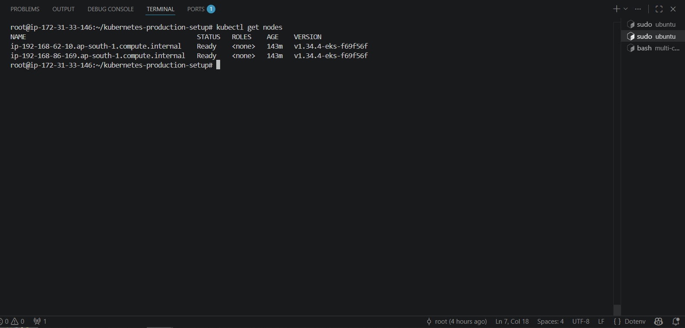

### Full Setup Guide
👉 [kubernetes-production-setup](https://github.com/manesaurabh1704-devops/kubernetes-production-setup)

---

## ⚡ Phase 3 — Jenkins CI/CD Pipeline

### What
Automated CI/CD pipeline — from code push to EKS deployment, fully automated.

### Why
```
Manual workflow:
  Developer → docker build → docker push → kubectl apply → Done
  Problem: Slow + error-prone + no security scanning

Jenkins pipeline:
  Git Push → Maven Build → npm Build → Trivy Scan → 
  Docker Build → DockerHub Push → EKS Deploy
  Benefit: Fast + consistent + secure + auditable
```

### Pipeline Flow

```
Stage 1: Git Checkout       — Pull latest code from GitHub
Stage 2: Maven Build        — Compile Spring Boot JAR
Stage 3: npm Build          — Build React production bundle
Stage 4: Trivy Scan         — Scan Docker images for vulnerabilities
Stage 5: Docker Build       — Build multi-stage images
Stage 6: DockerHub Push     — Push images with build number tag
Stage 7: EKS Deploy         — kubectl apply to update deployments
```

### Build Stats
```
Total build time: ~3 min 37 sec
Stages: 7
Trivy scan: Integrated (blocks CRITICAL vulnerabilities)
Image tagging: Build number based (easy rollback)
```

### Output / Proof

#### Pipeline Success
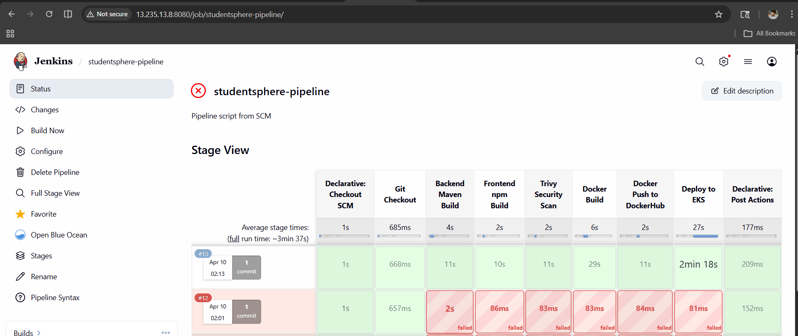

#### All Stages Green
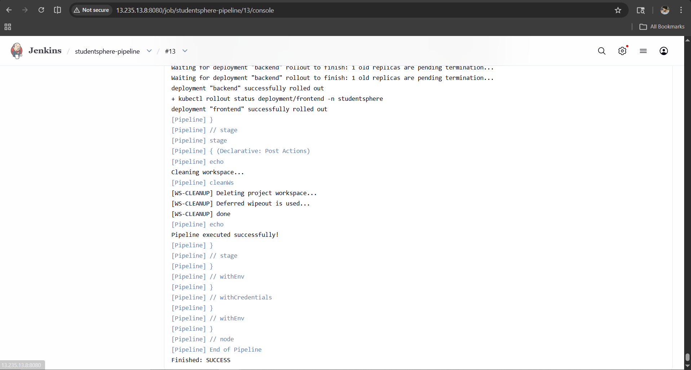

### Full Pipeline Setup Guide
👉 [ci-cd-devops-pipelines](https://github.com/manesaurabh1704-devops/ci-cd-devops-pipelines)

---

## ⚡ Phase 4 — Terraform Infrastructure as Code

### What
Complete AWS infrastructure defined as code — VPC, EKS, ECR provisioned with a single command.

### Why
```
Without Terraform (Manual):
  eksctl create cluster ... (not reproducible)
  Manual VPC setup (error-prone)
  No version control for infra
  
With Terraform:
  terraform apply = entire infra in 15 minutes
  Version controlled infrastructure
  Same code reusable for Azure + GCP
  Team can review infra changes like code
```

### Resources Created (24 total)

```
Networking:   VPC + 6 Subnets + IGW + Route Tables
Compute:      EKS Cluster + Node Group + IAM Roles (3)
Registry:     ECR Repositories (2) + Lifecycle Policies (2)
```

### Output / Proof

#### Terraform Init
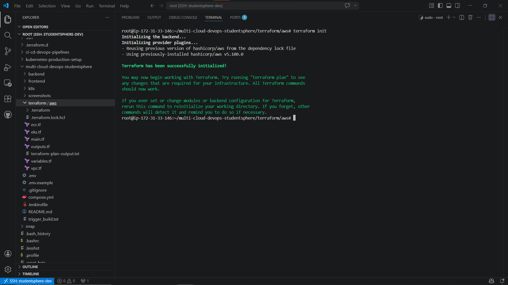

#### Terraform Plan — 24 Resources
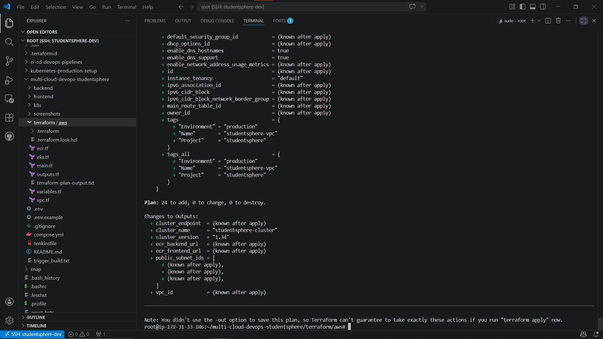

#### GitHub Terraform Files
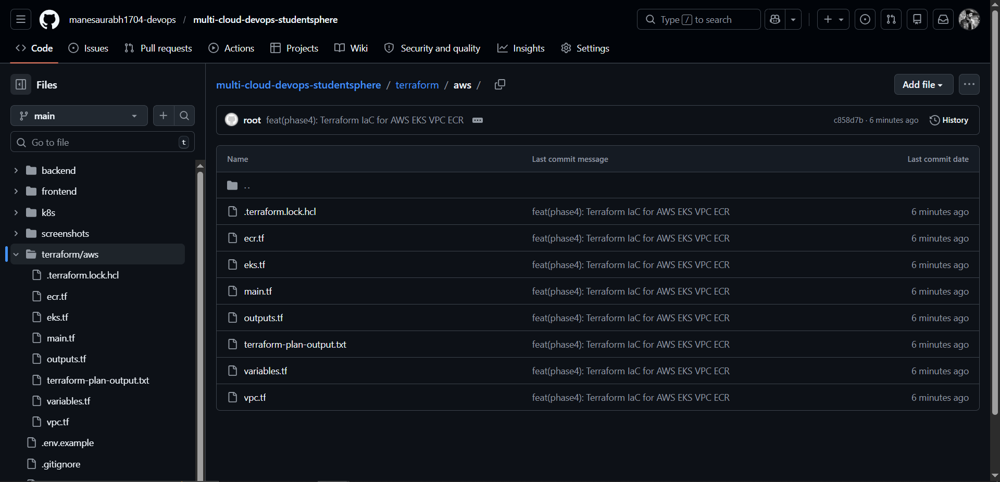

### Full Terraform Code
👉 [terraform-multi-cloud-infra](https://github.com/manesaurabh1704-devops/terraform-multi-cloud-infra)

---

## ⚡ Phase 5 — Advanced Kubernetes Features

### What
HPA auto-scaling + Canary deployment + Blue-Green zero downtime deployment on AWS EKS.

### Why
```
HPA:        Load increases → pods auto-scale 2→5 → handle traffic spike
Canary:     Test new version on 33% traffic → no risk to 67% users
Blue-Green: Switch 100% traffic instantly → zero downtime deployment
```

### Output / Proof

#### HPA Working — Auto Scaling


#### Canary Deployment
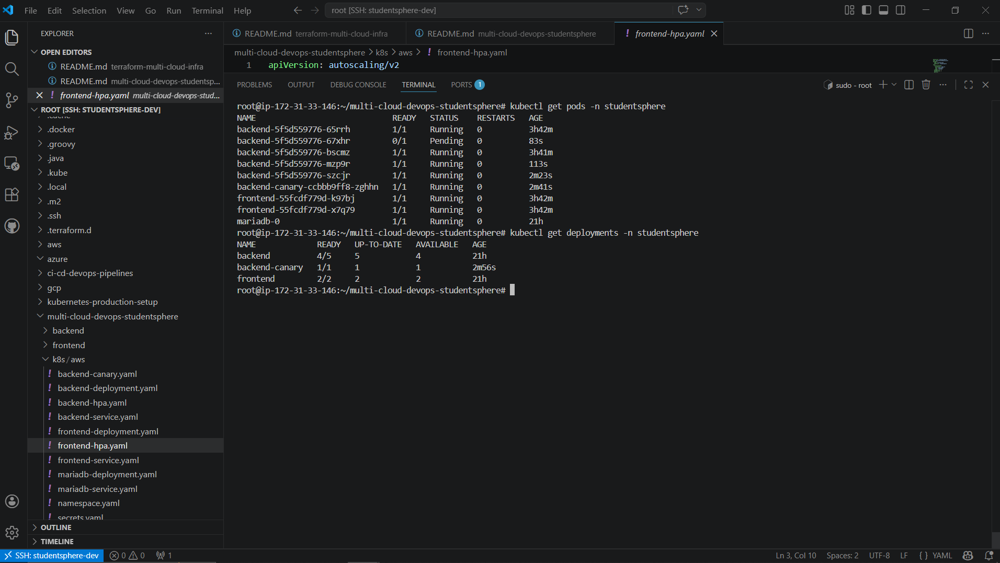

#### Blue-Green Switch
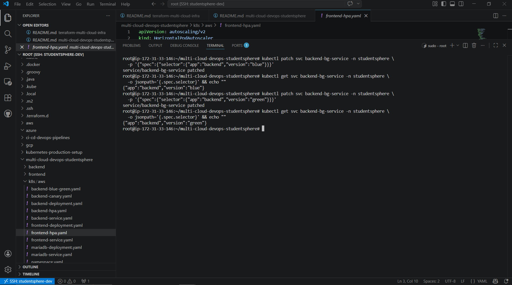

#### All Deployments Running


### Full Documentation
👉 [docs/PHASE5-ADVANCED-K8S.md](docs/PHASE5-ADVANCED-K8S.md)

---

## ⚡ Phase 6 — GitOps with ArgoCD

### What
ArgoCD watches GitHub repo — automatically deploys to EKS on every git push.

### Why
```
Without GitOps:
  Developer → kubectl apply (manual, error-prone, no audit trail)

With GitOps (ArgoCD):
  Developer → git push → ArgoCD detects → Auto-deploy → EKS
  Benefits: Audit trail + rollback + self-heal + single source of truth
```

### Output / Proof

#### ArgoCD Dashboard


#### Application Detail Tree


#### Application Synced


#### Sync Status


### Full Documentation
👉 [docs/PHASE6-ARGOCD.md](docs/PHASE6-ARGOCD.md)

---

## ⚡ Phase 7 — Security (Zero Trust Approach)

### What
RBAC + Network Policies + Trivy Image Scanning — Zero Trust security on AWS EKS.

### Why
```
Zero Trust = "Never trust, always verify"

Without Security:
  Any pod can access any resource
  Frontend can directly connect to MariaDB
  Vulnerable images deployed to production

With Zero Trust:
  RBAC: Each pod has minimum required permissions only
  Network Policies: Frontend → Backend → MariaDB (strictly enforced)
  Trivy: Vulnerabilities caught before deployment
```

### Scan Results Summary
```
Backend Image:  12 vulnerabilities (HIGH: 11, CRITICAL: 1)
                → Tomcat 10.1.31 (fix: upgrade to 10.1.35+)

Frontend Image: 20 vulnerabilities (HIGH: 17, CRITICAL: 3)
                → Alpine 3.19.1 (fix: upgrade to 3.20+)
```

### Output / Proof

#### RBAC — Roles and Bindings
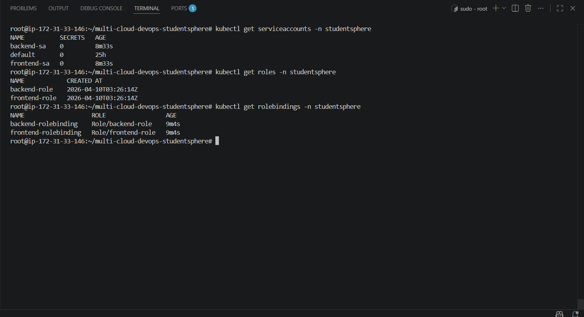

#### Network Policies
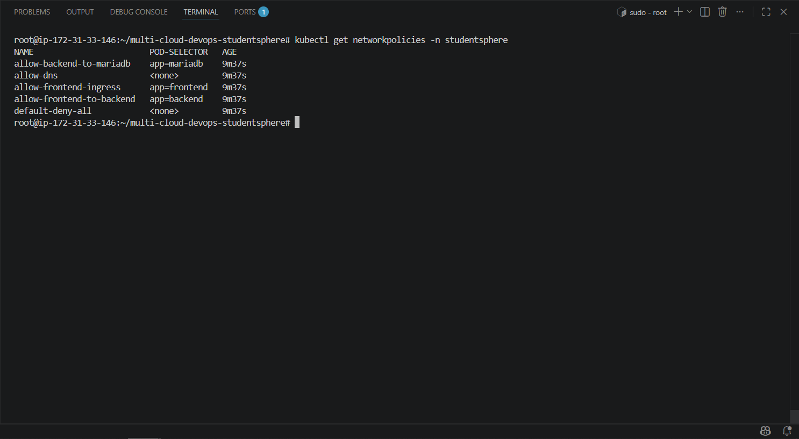

#### Trivy Backend Scan
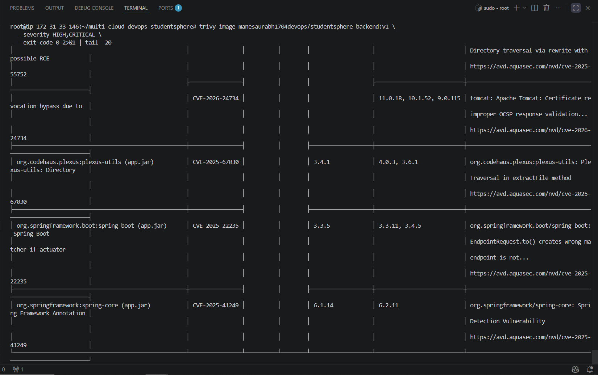

#### Trivy Frontend Scan
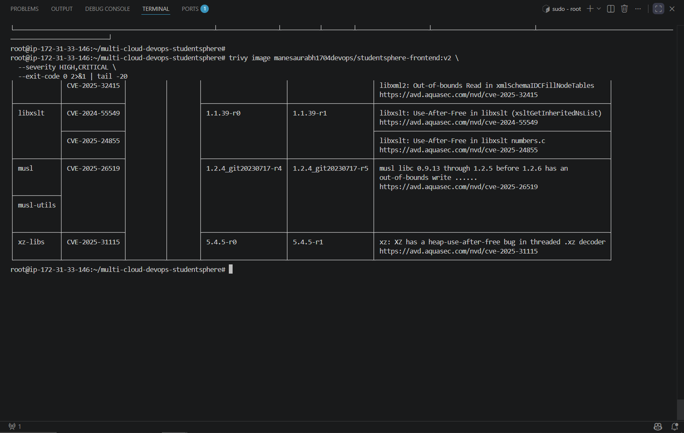

### Full Documentation
👉 [docs/PHASE7-SECURITY.md](docs/PHASE7-SECURITY.md)

---

## ⚡ Phase 8 — Observability (Prometheus + Grafana + Alertmanager)

### What
Full monitoring stack on AWS EKS — Prometheus + Grafana + Alertmanager via Helm.

### Why
```
Without Observability:
  App is slow → no idea why, when, or what happened

With Observability:
  Prometheus: collects metrics from all 31 targets every 15 seconds
  Grafana: dashboards show CPU, Memory, Pod health in real-time
  Alertmanager: routes alerts when thresholds are breached
```

### Key Metrics
```
Cluster CPU:          3.23%
Cluster Memory:       54.2%
studentsphere CPU:    0.565%
studentsphere Memory: 74.1%
Prometheus Targets:   31 UP
```

### Output / Proof

#### Grafana Dashboard
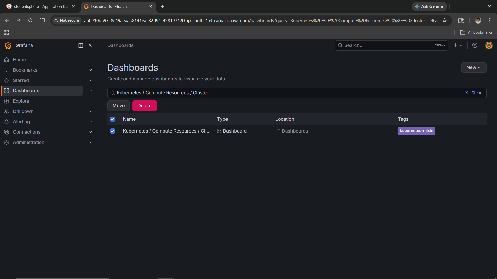

#### Kubernetes Cluster Overview
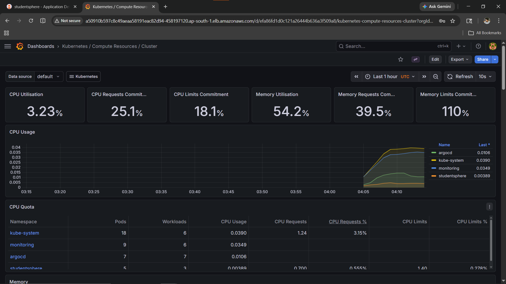

#### StudentSphere Pods Metrics
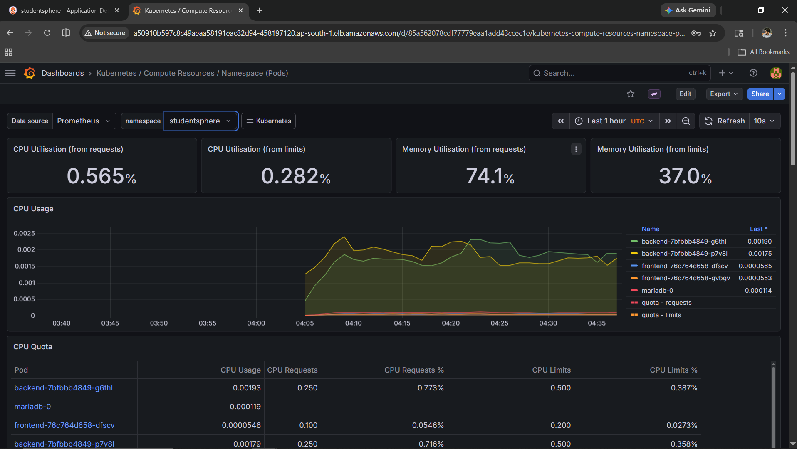

#### Prometheus Targets — All UP
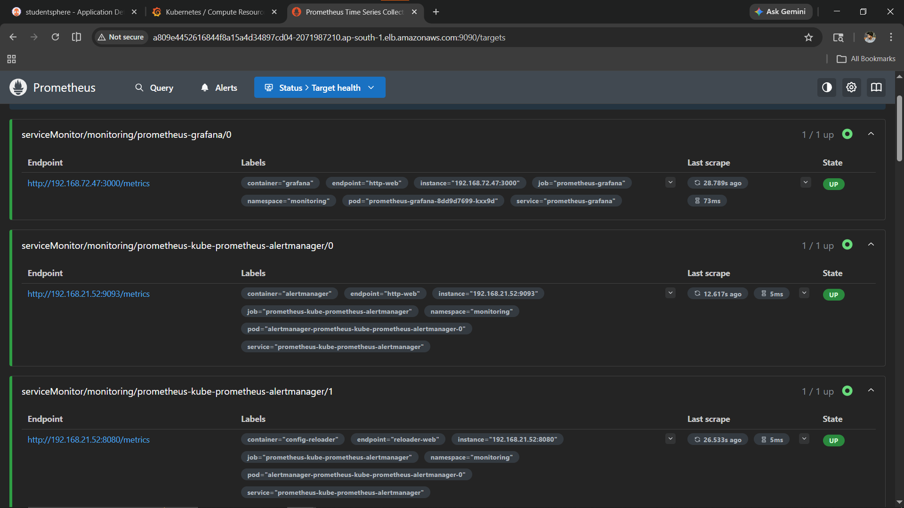

#### Alertmanager
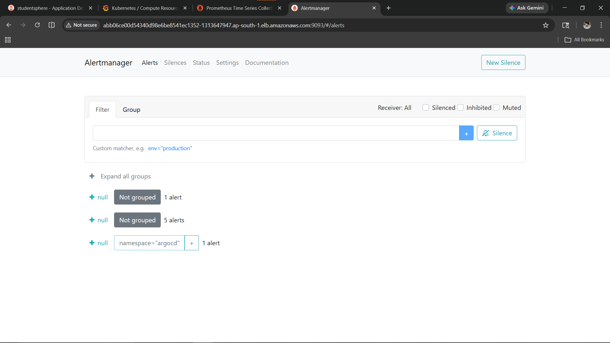

### Full Documentation
👉 [docs/PHASE8-OBSERVABILITY.md](docs/PHASE8-OBSERVABILITY.md)

### Monitoring Stack Repo
👉 [monitoring-observability-stack](https://github.com/manesaurabh1704-devops/monitoring-observability-stack)

---

## ⚡ Phase 9 — Multi-Cloud (Azure AKS + GCP GKE)

### What
Same StudentSphere app deployed on Azure AKS and GCP GKE — proving cloud-agnostic Kubernetes skills.

### Why
```
Single cloud = vendor lock-in risk
Multi-cloud = flexibility + resilience + cost optimization

Same Docker images + same K8s manifests → works on any cloud
Only the cluster endpoint and storage class change
```

### Output / Proof

#### Azure AKS — App Running


#### GCP GKE — App Running


### Full Documentation
👉 [docs/PHASE9-MULTI-CLOUD.md](docs/PHASE9-MULTI-CLOUD.md)

---

## 🔗 Related Repositories

| Repository | Purpose |
|---|---|
| [kubernetes-production-setup](https://github.com/manesaurabh1704-devops/kubernetes-production-setup) | All K8s manifests — Deployment, Service, HPA, RBAC, Network Policies |
| [terraform-multi-cloud-infra](https://github.com/manesaurabh1704-devops/terraform-multi-cloud-infra) | AWS + Azure + GCP Infrastructure as Code |
| [ci-cd-devops-pipelines](https://github.com/manesaurabh1704-devops/ci-cd-devops-pipelines) | Jenkins pipelines + Trivy scanning |
| [monitoring-observability-stack](https://github.com/manesaurabh1704-devops/monitoring-observability-stack) | Prometheus + Grafana + Alertmanager |
| [devops-security-secrets](https://github.com/manesaurabh1704-devops/devops-security-secrets) | RBAC + Network Policies + Trivy |

---

## 👨‍💻 Author

**Saurabh Mane** — DevOps Engineer
- GitHub: [@manesaurabh1704-devops](https://github.com/manesaurabh1704-devops)

---

> ⭐ Star this repository if you find it helpful!
