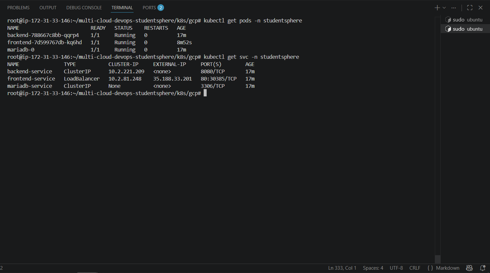
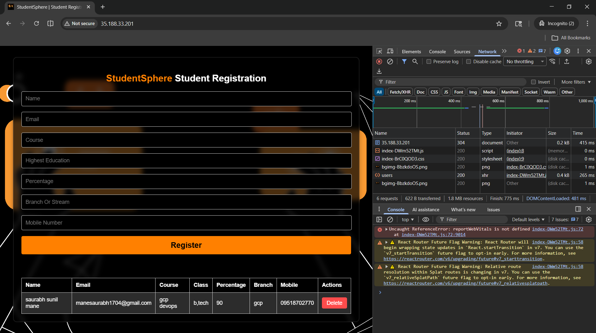
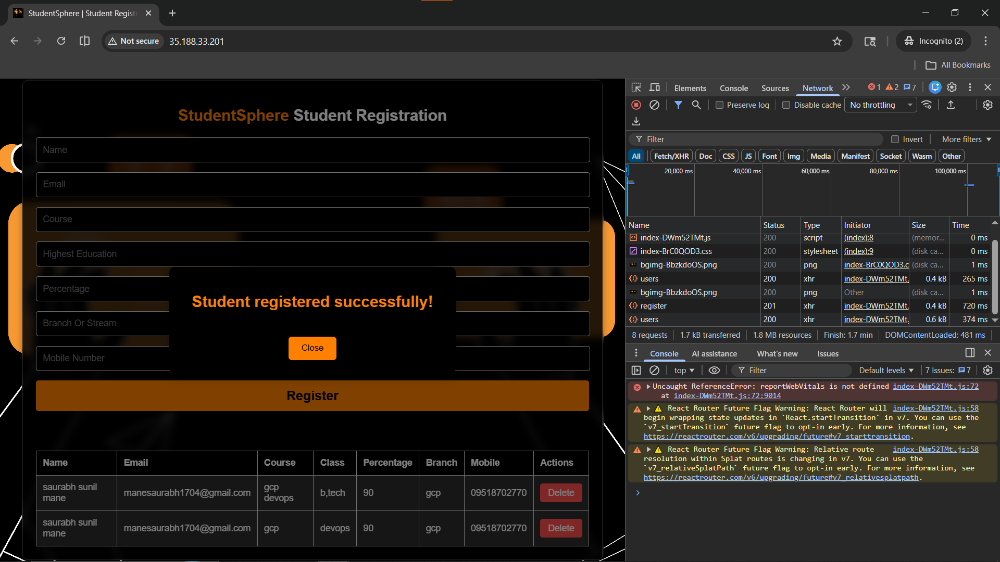
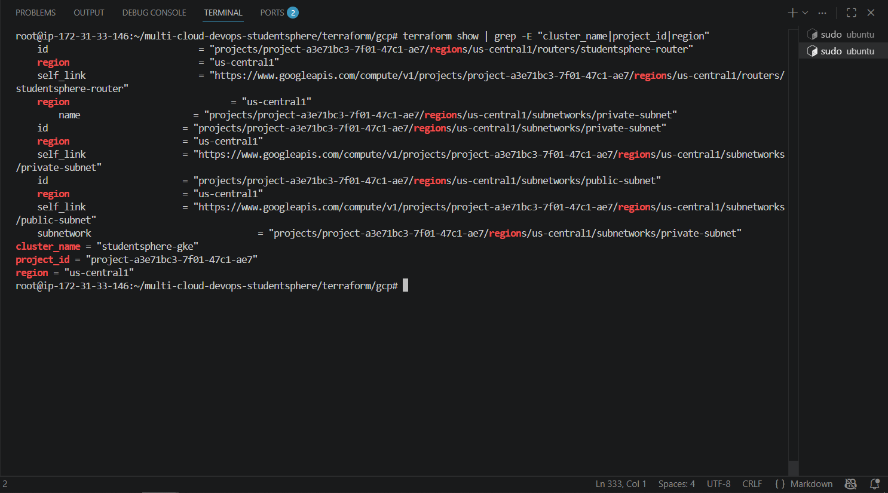

# Phase 10 — GCP GKE Deployment

> StudentSphere deployed on Google Cloud Platform GKE — production-grade setup.
> Private nodes + Cloud NAT + Public Load Balancer — FAANG-style architecture.
> Part of [multi-cloud-devops-studentsphere](https://github.com/manesaurabh1704-devops/multi-cloud-devops-studentsphere)

---

## 🎯 Why GCP GKE?

```
Multi-Cloud Strategy:
AWS EKS   → Primary cloud
Azure AKS → Secondary cloud
GCP GKE   → Tertiary cloud

GCP GKE advantages:
→ Google managed Kubernetes (Google invented K8s!)
→ Autopilot mode available
→ Best-in-class networking
→ Same K8s manifests as AWS + Azure — cloud-agnostic!
```

---

## 🏗️ Architecture

```
Internet
    ↓
GCP Load Balancer (Public)
    ↓
GKE Nodes (Private Subnet — 10.0.2.0/24)
    ↓
Cloud NAT (Outbound internet for nodes)
    ↓
StudentSphere App (Backend + Frontend + MariaDB)
```

### Why Private Nodes?
```
Production-grade setup:
✅ Nodes NOT directly exposed to internet
✅ Cloud NAT = nodes can pull images + updates
✅ Load Balancer = only public entry point
✅ Same as FAANG companies use!
```

---

## 🌐 GCP Infrastructure Created

| Resource | Type | Description |
|---|---|---|
| studentsphere-vpc | VPC Network | Main virtual network |
| public-subnet | Subnet (10.0.1.0/24) | Load Balancer only |
| private-subnet | Subnet (10.0.2.0/24) | GKE Nodes |
| studentsphere-router | Cloud Router | For Cloud NAT |
| studentsphere-nat | Cloud NAT | Outbound internet for nodes |
| studentsphere-gke | GKE Cluster | Managed Kubernetes v1.35.1 |
| studentsphere-nodes | Node Pool | e2-medium worker nodes |

**Total: 7 resources**

---

## ⚡ How to Deploy

### Prerequisites

```bash
# GCP CLI install
curl https://sdk.cloud.google.com | bash
source ~/.bashrc
gcloud --version

# GKE auth plugin install
gcloud components install gke-gcloud-auth-plugin

# Terraform install
terraform --version
```

### Step 1 — GCP Login

```bash
gcloud auth login --no-launch-browser
gcloud auth application-default login --no-launch-browser
```

### Step 2 — Set Project

```bash
gcloud projects list
gcloud config set project YOUR_PROJECT_ID

# Verify
gcloud config get-value project
```

### Step 3 — Enable APIs

```bash
gcloud services enable container.googleapis.com
gcloud services enable compute.googleapis.com
```

Expected output:
```
Operation finished successfully.
```

### Step 4 — Terraform Init

```bash
cd terraform/gcp
terraform init
```

Expected output:
```
Terraform has been successfully initialized!
```

### Step 5 — Terraform Plan

```bash
terraform plan 2>&1 | tail -15
```

Expected output:
```
Plan: 7 to add, 0 to change, 0 to destroy.

Changes to Outputs:
  + cluster_endpoint = (sensitive value)
  + cluster_name     = "studentsphere-gke"
  + project_id       = "your-project-id"
  + region           = "us-central1"
```

### Step 6 — Terraform Apply

```bash
terraform apply -auto-approve
```

Expected output:
```
Apply complete! Resources: 7 added, 0 changed, 0 destroyed.

Outputs:
cluster_name = "studentsphere-gke"
project_id   = "your-project-id"
region       = "us-central1"
```

### Step 7 — Configure kubectl

```bash
gcloud container clusters get-credentials studentsphere-gke \
  --zone us-central1-a \
  --project YOUR_PROJECT_ID

kubectl get nodes
```

Expected output:
```
NAME                                                  STATUS   ROLES    AGE   VERSION
gke-studentsphere-gk-studentsphere-no-xxxx-xxxx       Ready    <none>   5m    v1.35.1-gke
gke-studentsphere-gk-studentsphere-no-xxxx-xxxx       Ready    <none>   5m    v1.35.1-gke
```

### Step 8 — Deploy App

```bash
cd k8s/gcp

kubectl apply -f namespace.yaml
kubectl apply -f secrets.yaml
kubectl apply -f mariadb-deployment.yaml
kubectl apply -f mariadb-service.yaml
kubectl apply -f backend-deployment.yaml
kubectl apply -f backend-service.yaml
kubectl apply -f frontend-deployment.yaml
kubectl apply -f frontend-service.yaml
```

### Step 9 — Verify Deployment

```bash
kubectl get pods -n studentsphere
kubectl get svc -n studentsphere
```

Expected output:
```
NAME                        READY   STATUS    RESTARTS
backend-xxxx                1/1     Running   0
frontend-xxxx               1/1     Running   0
mariadb-0                   1/1     Running   0

NAME               TYPE           EXTERNAL-IP     PORT(S)
frontend-service   LoadBalancer   35.188.33.201   80:30385/TCP
backend-service    ClusterIP      <none>          8080/TCP
mariadb-service    ClusterIP      None            3306/TCP
```

### Step 10 — Access App

```
http://<EXTERNAL-IP>
```

### Step 11 — Destroy (Cost Save)

```bash
cd terraform/gcp
terraform destroy -auto-approve
```

---

## 📸 Output / Proof

### GCP GKE Nodes Ready


### All Pods Running


### App Running on GCP


### Student Registered Successfully


### Terraform Apply Output


---

## 🐛 Troubleshooting

### Problem 1 — gke-gcloud-auth-plugin Not Found
```
Error: executable gke-gcloud-auth-plugin not found

Fix:
gcloud components install gke-gcloud-auth-plugin
source ~/.bashrc
```

### Problem 2 — Billing Not Enabled
```
Error: Billing account for project not found

Fix: Enable billing in GCP Console
https://console.cloud.google.com/billing
Link billing account to project
```

### Problem 3 — Insufficient CPU
```
Error: 0/2 nodes available: Insufficient cpu

Fix: Scale down replicas
kubectl scale deployment backend --replicas=1 -n studentsphere
kubectl scale deployment frontend --replicas=1 -n studentsphere
```

### Problem 4 — CORS Error / Old IP
```
Error: Access blocked by CORS — old AWS IP

Fix: Use updated frontend image
kubectl set image deployment/frontend \
  frontend=manesaurabh1704devops/studentsphere-frontend:v3 \
  -n studentsphere
```

### Problem 5 — StorageClass Not Found
```
Error: storageclass "gp2" not found

Fix: Use GCP storage class in mariadb-deployment.yaml
storageClassName: standard
```

---

## 🔗 Related Repositories

| Repository | Purpose |
|---|---|
| [multi-cloud-devops-studentsphere](https://github.com/manesaurabh1704-devops/multi-cloud-devops-studentsphere) | Main project |
| [kubernetes-production-setup](https://github.com/manesaurabh1704-devops/kubernetes-production-setup) | K8s manifests |
| [terraform-multi-cloud-infra](https://github.com/manesaurabh1704-devops/terraform-multi-cloud-infra) | Infrastructure as Code |

---

## 👨‍💻 Author
**Saurabh Mane** — DevOps Engineer
- GitHub: [@manesaurabh1704-devops](https://github.com/manesaurabh1704-devops)

---

> ⭐ Star this repo if you find it helpful!
