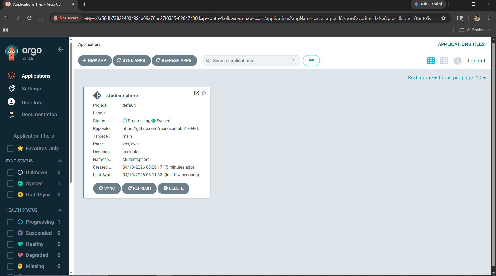
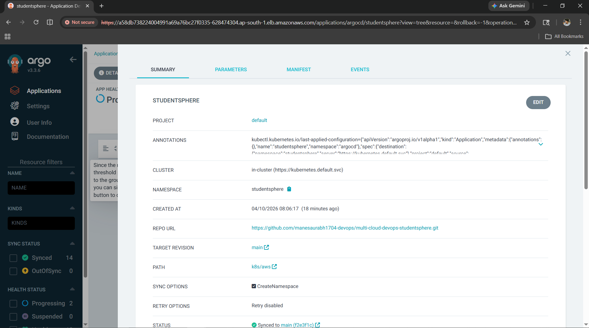
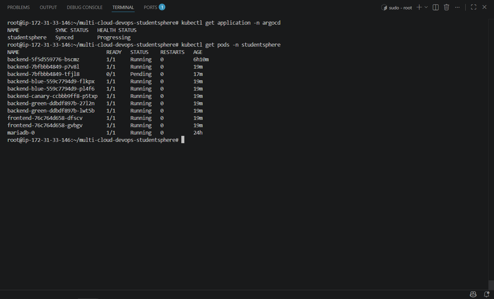
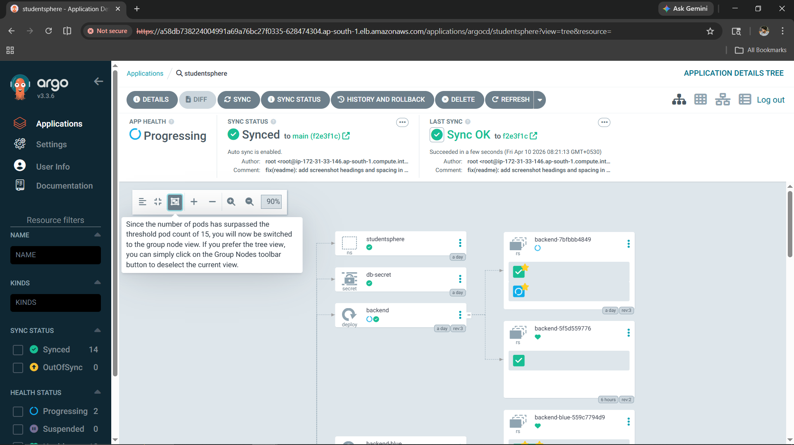

# Phase 6 — GitOps with ArgoCD

> Automated deployment from GitHub to AWS EKS using ArgoCD.
> Part of [multi-cloud-devops-studentsphere](https://github.com/manesaurabh1704-devops/multi-cloud-devops-studentsphere)

---

## What is GitOps?

```
Traditional:  Developer → kubectl apply → Cluster
GitOps:       Developer → git push → ArgoCD detects → Auto deploy → Cluster
```

---

## What is ArgoCD?

ArgoCD is a declarative GitOps continuous delivery tool for Kubernetes.
It watches a GitHub repository and automatically syncs changes to the cluster.

---

## Architecture

```
GitHub Repository (k8s/aws/)
        ↓
    ArgoCD watches for changes
        ↓
    Change detected in main branch
        ↓
    ArgoCD auto-syncs to EKS
        ↓
    Kubernetes resources updated
```

---

## Why ArgoCD?

| Without ArgoCD | With ArgoCD |
|---|---|
| Manual `kubectl apply` after every change | Automatic sync on git push |
| No visibility of what is deployed | Full UI with resource tree |
| Manual rollback required | One-click rollback via UI |
| No drift detection | Auto self-heal if cluster drifts |
| Jenkins needed for deployment | Git is single source of truth |

---

## How to Setup ArgoCD

### Prerequisites
```bash
kubectl version --client
aws eks update-kubeconfig --region ap-south-1 --name studentsphere-cluster
kubectl get nodes
```

### Step 1 — Install ArgoCD

```bash
# Create namespace
kubectl create namespace argocd

# Install ArgoCD
kubectl apply -n argocd -f \
  https://raw.githubusercontent.com/argoproj/argo-cd/stable/manifests/install.yaml
```

### Step 2 — Wait for Pods to be Ready

```bash
kubectl get pods -n argocd -w
```

Expected output:
```
NAME                                               READY   STATUS
argocd-application-controller-0                    1/1     Running
argocd-applicationset-controller-xxxx              1/1     Running
argocd-dex-server-xxxx                             1/1     Running
argocd-notifications-controller-xxxx               1/1     Running
argocd-redis-xxxx                                  1/1     Running
argocd-repo-server-xxxx                            1/1     Running
argocd-server-xxxx                                 1/1     Running
```

### Step 3 — Expose ArgoCD UI

```bash
kubectl patch svc argocd-server -n argocd \
  -p '{"spec": {"type": "LoadBalancer"}}'

# Get external URL
kubectl get svc argocd-server -n argocd
```

Expected output:
```
NAME            TYPE           EXTERNAL-IP
argocd-server   LoadBalancer   xxxx.ap-south-1.elb.amazonaws.com
```

### Step 4 — Get Admin Password

```bash
kubectl -n argocd get secret argocd-initial-admin-secret \
  -o jsonpath="{.data.password}" | base64 -d && echo
```

### Step 5 — Login to ArgoCD UI

```
URL:      http://<EXTERNAL-IP>
Username: admin
Password: <from step 4>
```

### Step 6 — Create ArgoCD Application

```bash
kubectl apply -f k8s/aws/argocd-app.yaml
```

`argocd-app.yaml`:
```yaml
apiVersion: argoproj.io/v1alpha1
kind: Application
metadata:
  name: studentsphere
  namespace: argocd
spec:
  project: default
  source:
    repoURL: https://github.com/manesaurabh1704-devops/multi-cloud-devops-studentsphere.git
    targetRevision: main
    path: k8s/aws
  destination:
    server: https://kubernetes.default.svc
    namespace: studentsphere
  syncPolicy:
    automated:
      prune: true
      selfHeal: true
    syncOptions:
      - CreateNamespace=true
```

### Step 7 — Verify Sync Status

```bash
kubectl get application -n argocd
```

Expected output:
```
NAME            SYNC STATUS   HEALTH STATUS
studentsphere   Synced        Healthy
```

---

## How Auto-Sync Works

```
1. Developer makes change in k8s/aws/ folder
2. git push to main branch
3. ArgoCD detects change (polls every 3 minutes)
4. ArgoCD applies changes to EKS cluster
5. Health status updates to Healthy
```

---

## Output / Proof

### ArgoCD Dashboard


### Application Detail Tree


### Application Synced


### Sync Status


---

## Troubleshooting

### Problem 1 — ArgoCD Pods Pending
```
Error: 0/2 nodes available: Too many pods

Fix: Scale up node group
eksctl scale nodegroup \
  --cluster studentsphere-cluster \
  --name studentsphere-nodes \
  --nodes 3 \
  --region ap-south-1
```

### Problem 2 — dex-server CrashLoopBackOff
```
Error: argocd-dex-server CrashLoopBackOff

Fix: Restart the deployment
kubectl rollout restart deployment argocd-dex-server -n argocd
```

### Problem 3 — Application OutOfSync
```
Error: SYNC STATUS: OutOfSync

Fix: Force sync
kubectl patch app studentsphere -n argocd \
  -p '{"operation": {"initiatedBy": {"username": "admin"}, "sync": {"revision": "HEAD"}}}' \
  --type merge
```

### Problem 4 — Cannot Login to ArgoCD UI
```
Error: invalid username or password

Fix: Reset admin password
kubectl -n argocd patch secret argocd-secret \
  -p '{"stringData": {"admin.password": "$2a$10$..."} }'
```

---

## Related Repositories

| Repository | Purpose |
|---|---|
| [multi-cloud-devops-studentsphere](https://github.com/manesaurabh1704-devops/multi-cloud-devops-studentsphere) | Main project |
| [kubernetes-production-setup](https://github.com/manesaurabh1704-devops/kubernetes-production-setup) | K8s manifests |
| [ci-cd-devops-pipelines](https://github.com/manesaurabh1704-devops/ci-cd-devops-pipelines) | Jenkins CI/CD |
| [terraform-multi-cloud-infra](https://github.com/manesaurabh1704-devops/terraform-multi-cloud-infra) | Infrastructure as Code |

---

## Author
**Saurabh Mane** — DevOps Engineer
- GitHub: [@manesaurabh1704-devops](https://github.com/manesaurabh1704-devops)

---

> ⭐ Star this repo if you find it helpful!