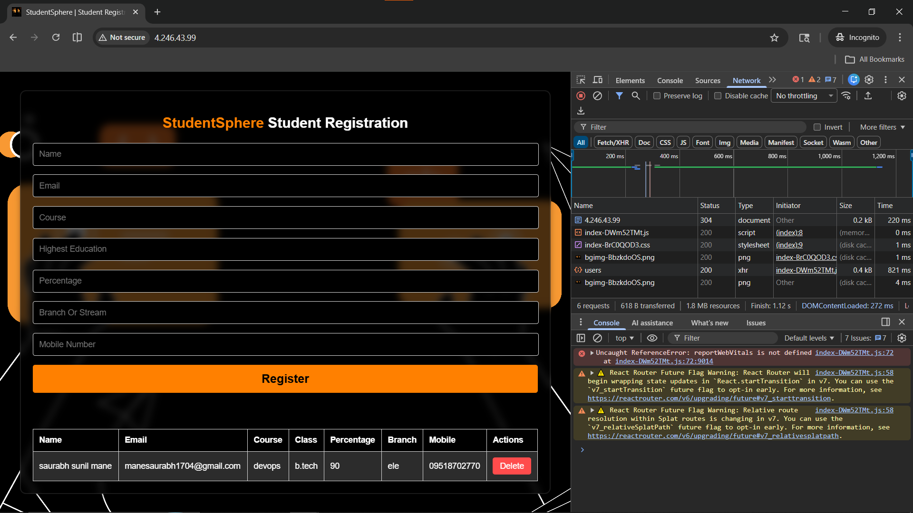
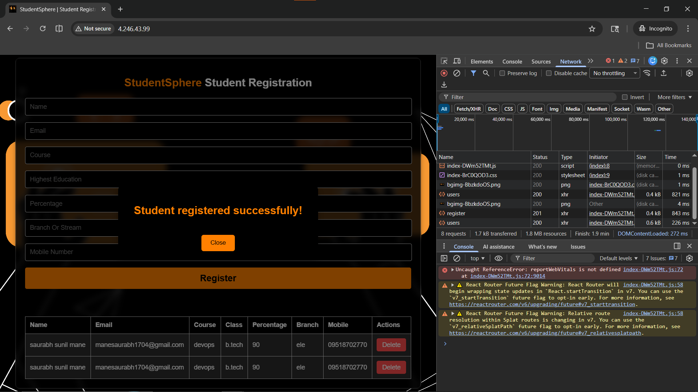
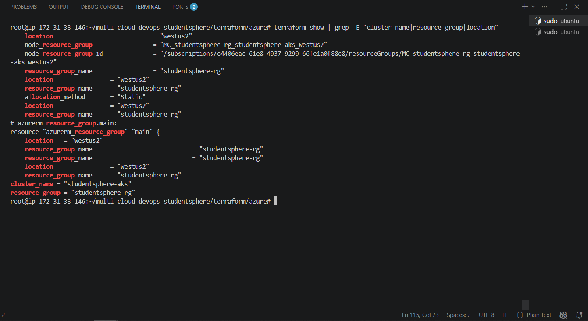

# Phase 9 — Azure AKS Deployment

> StudentSphere deployed on Microsoft Azure AKS — production-grade setup.
> Private nodes + NAT Gateway + Public Load Balancer — FAANG-style architecture.
> Part of [multi-cloud-devops-studentsphere](https://github.com/manesaurabh1704-devops/multi-cloud-devops-studentsphere)

---

## 🎯 Why Azure AKS?

```
Single Cloud Risk:     If AWS goes down → App goes down
Multi-Cloud Benefit:   AWS down → Switch to Azure instantly

Azure AKS advantages:
→ Microsoft managed Kubernetes
→ Free cluster management (pay only for nodes)
→ Native Azure Active Directory integration
→ Same K8s manifests as AWS — cloud-agnostic!
```

---

## 🏗️ Architecture

```
Internet
    ↓
Azure Load Balancer (Public Subnet — 10.0.1.0/24)
    ↓
AKS Nodes (Private Subnet — 10.0.2.0/24)
    ↓
NAT Gateway (Outbound internet for nodes)
    ↓
StudentSphere App (Backend + Frontend + MariaDB)
```

### Why Private Nodes?
```
Production-grade setup:
✅ Nodes NOT directly exposed to internet
✅ NAT Gateway = nodes can pull images + updates
✅ Load Balancer = only public entry point
✅ Same as FAANG companies use!
```

---

## 🌐 Azure Infrastructure Created

| Resource | Type | Description |
|---|---|---|
| studentsphere-rg | Resource Group | Container for all resources |
| studentsphere-vnet | VNet (10.0.0.0/16) | Main virtual network |
| public-subnet | Subnet (10.0.1.0/24) | Load Balancer only |
| private-subnet | Subnet (10.0.2.0/24) | AKS Nodes |
| studentsphere-nat-ip | Public IP | NAT Gateway IP |
| studentsphere-nat | NAT Gateway | Outbound internet for nodes |
| studentsphere-aks | AKS Cluster | Managed Kubernetes v1.35.1 |

---

## ⚡ How to Deploy

### Prerequisites

```bash
# Azure CLI install
curl -sL https://aka.ms/InstallAzureCLIDeb | sudo bash
az --version

# Login to Azure
az login --use-device-code

# Terraform install
terraform --version
```

### Step 1 — Azure Login

```bash
az login --use-device-code
az account show --output table
```

Expected output:
```
EnvironmentName    Name                  State    
-----------------  --------------------  -------  
AzureCloud         Azure subscription 1  Enabled  
```

### Step 2 — Register Providers

```bash
az provider register --namespace Microsoft.ContainerService
az provider register --namespace Microsoft.Network
az provider register --namespace Microsoft.Compute

# Verify
az provider show -n Microsoft.ContainerService --query "registrationState"
```

Expected output:
```
"Registered"
```

### Step 3 — Terraform Init

```bash
cd terraform/azure
terraform init
```

Expected output:
```
Terraform has been successfully initialized!
```

### Step 4 — Terraform Plan

```bash
terraform plan 2>&1 | tail -15
```

Expected output:
```
Plan: 9 to add, 0 to change, 0 to destroy.

Changes to Outputs:
  + cluster_endpoint  = (sensitive value)
  + cluster_name      = "studentsphere-aks"
  + private_subnet_id = (known after apply)
  + public_subnet_id  = (known after apply)
  + resource_group    = "studentsphere-rg"
```

### Step 5 — Terraform Apply

```bash
terraform apply -auto-approve
```

Expected output:
```
azurerm_kubernetes_cluster.main: Creation complete after 4m17s
Apply complete! Resources: 9 added, 0 changed, 0 destroyed.

Outputs:
cluster_name      = "studentsphere-aks"
resource_group    = "studentsphere-rg"
```

### Step 6 — Configure kubectl

```bash
az aks get-credentials \
  --resource-group studentsphere-rg \
  --name studentsphere-aks \
  --overwrite-existing

kubectl get nodes
```

Expected output:
```
NAME                              STATUS   ROLES    AGE   VERSION
aks-default-xxxx-vmss000000       Ready    <none>   5m    v1.35.1
aks-default-xxxx-vmss000001       Ready    <none>   5m    v1.35.1
```

### Step 7 — Deploy App

```bash
cd k8s/azure

kubectl apply -f namespace.yaml
kubectl apply -f secrets.yaml
kubectl apply -f mariadb-deployment.yaml
kubectl apply -f mariadb-service.yaml
kubectl apply -f backend-deployment.yaml
kubectl apply -f backend-service.yaml
kubectl apply -f frontend-deployment.yaml
kubectl apply -f frontend-service.yaml
```

### Step 8 — Verify Deployment

```bash
kubectl get pods -n studentsphere
kubectl get svc -n studentsphere
```

Expected output:
```
NAME                        READY   STATUS    RESTARTS
backend-xxxx                1/1     Running   0
backend-xxxx                1/1     Running   0
frontend-xxxx               1/1     Running   0
frontend-xxxx               1/1     Running   0
mariadb-0                   1/1     Running   0

NAME               TYPE           EXTERNAL-IP    PORT(S)
frontend-service   LoadBalancer   4.246.43.99    80:31969/TCP
backend-service    ClusterIP      <none>         8080/TCP
mariadb-service    ClusterIP      None           3306/TCP
```

### Step 9 — Access App

```
http://<EXTERNAL-IP>
```

### Step 10 — Destroy (Cost Save)

```bash
cd terraform/azure
terraform destroy -auto-approve
```

---

## 📸 Output / Proof

### Azure AKS Nodes Ready


### All Pods Running


### App Running on Azure


### Student Registered Successfully


### Terraform Apply Output


---

## 🐛 Troubleshooting

### Problem 1 — VM Size Not Allowed
```
Error: The VM size of Standard_B2s is not allowed

Fix: Use Standard_B2s_v2
variable "node_size" {
  default = "Standard_B2s_v2"
}
```

### Problem 2 — K8s Version Not Supported
```
Error: K8sVersionNotSupported

Fix: Check supported versions
az aks get-versions --location westus2 --output table
# Use latest supported version e.g. 1.35.1
```

### Problem 3 — LoadBalancer Pending
```
Error: EXTERNAL-IP stuck at <pending>

Fix: Give AKS identity Network Contributor role
AKS_IDENTITY=$(az aks show \
  --resource-group studentsphere-rg \
  --name studentsphere-aks \
  --query "identity.principalId" -o tsv)

VNET_ID=$(az network vnet show \
  --resource-group studentsphere-rg \
  --name studentsphere-vnet \
  --query id -o tsv)

az role assignment create \
  --assignee $AKS_IDENTITY \
  --role "Network Contributor" \
  --scope $VNET_ID
```

### Problem 4 — CORS Error / Old IP in Frontend
```
Error: Access blocked by CORS — old AWS IP hardcoded

Fix: Update frontend .env
VITE_API_URL=/api  # Use nginx proxy instead of direct IP

Rebuild image:
docker build -t your-repo/studentsphere-frontend:v3 ./frontend/
docker push your-repo/studentsphere-frontend:v3

Update deployment:
kubectl set image deployment/frontend \
  frontend=your-repo/studentsphere-frontend:v3 \
  -n studentsphere
```

### Problem 5 — Service CIDR Overlap
```
Error: ServiceCidrOverlapExistingSubnetsCidr

Fix: Use different CIDR in aks.tf
network_profile {
  service_cidr   = "172.16.0.0/16"
  dns_service_ip = "172.16.0.10"
}
```

---

## 🔗 Related Repositories

| Repository | Purpose |
|---|---|
| [multi-cloud-devops-studentsphere](https://github.com/manesaurabh1704-devops/multi-cloud-devops-studentsphere) | Main project |
| [kubernetes-production-setup](https://github.com/manesaurabh1704-devops/kubernetes-production-setup) | K8s manifests |
| [terraform-multi-cloud-infra](https://github.com/manesaurabh1704-devops/terraform-multi-cloud-infra) | Infrastructure as Code |

---

## 👨‍💻 Author
**Saurabh Mane** — DevOps Engineer
- GitHub: [@manesaurabh1704-devops](https://github.com/manesaurabh1704-devops)

---

> ⭐ Star this repo if you find it helpful!
